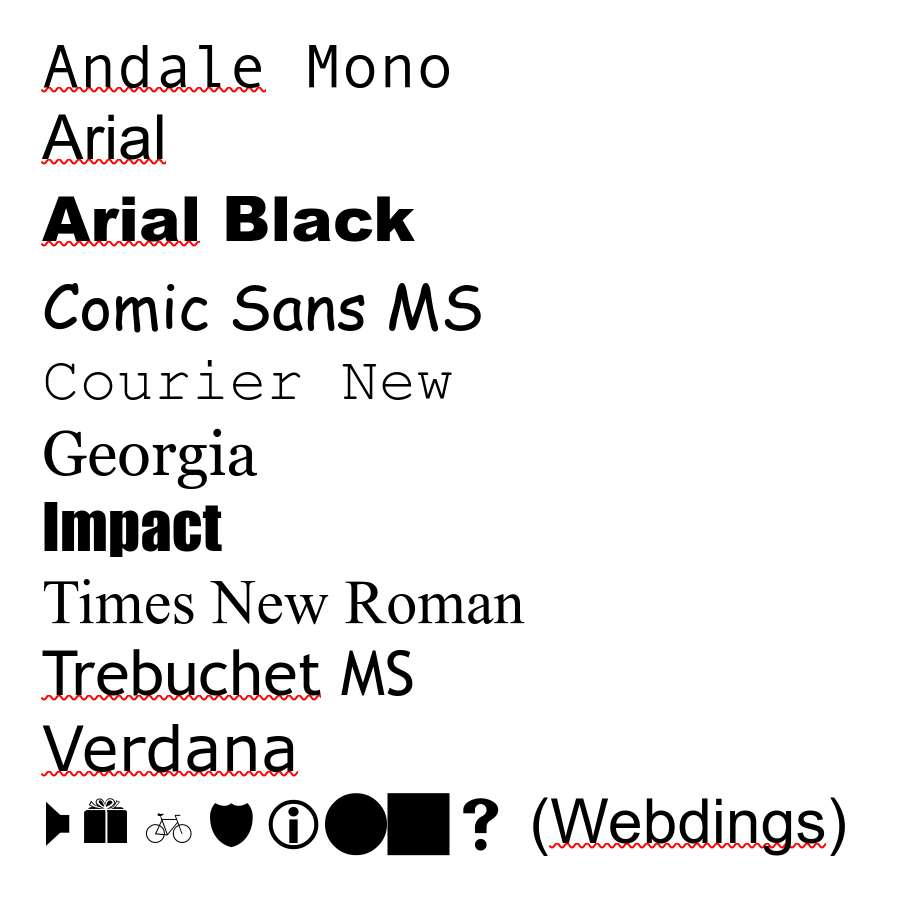

# TrueType4Linux
An automated installer for the "Microsoft TrueType Core" fonts on all linux distros.

## Included Fonts
- Andale Mono
- Arial
- Arial Black
- Comic Sans MS
- Courier New
- Georgia
- Impact
- Times New Roman
- Trebuchet MS
- Verdana
- Webdings

